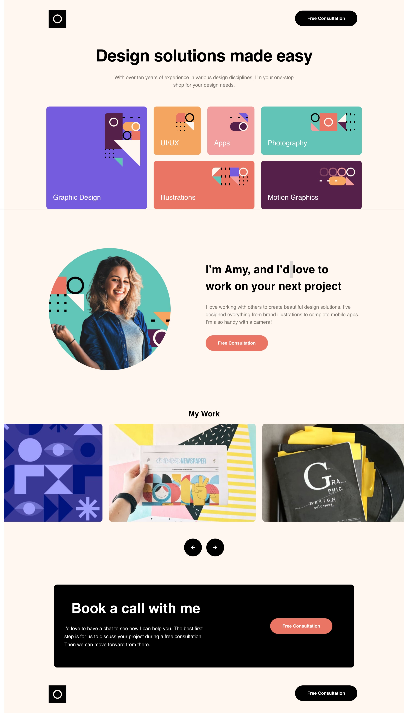

# Frontend Mentor - Single-page design portfolio solution

This is a solution to the [Single-page design portfolio challenge on Frontend Mentor](https://www.frontendmentor.io/challenges/singlepage-design-portfolio-2MMhyhfKVo). Frontend Mentor challenges help you improve your coding skills by building realistic projects. 

## Table of contents

- [Overview](#overview)
  - [The challenge](#the-challenge)
  - [Screenshot](#screenshot)
- [My process](#my-process)
  - [Built with](#built-with)
  - [What I learned](#what-i-learned)
  - [Continued development](#continued-development)

## Overview

### The challenge

Users should be able to:

- View the optimal layout for the site depending on their device's screen size
- See hover states for all interactive elements on the page
- Navigate the slider using either their mouse/trackpad or keyboard

### Screenshot

### Links

- Solution URL: [Github](https://github.com/arfernn/single-page-portfolio)
- Live Site URL: [Github Pages](https://arfernn.github.io/single-page-portfolio/)

## My process

### Built with

- Semantic HTML5 markup
- CSS custom properties
- Flexbox
- CSS Grid
- Mobile-first workflow
- Vanilla JS

### What I learned

I had the chance to practice a lot grid layouts with this project. It was a quite complete one. Also, it's the first time I have implemented an image slider (carousel), I did a very simple, non-infinite implementation which only uses a flexbox and scrolls on click, but the result is quite good I think.

There are multiple things to be improved yet though. I cover them in the next section.

### Continued development

I need to investigate if there is a better way to customize component arrangement when using grid layout. In this project the order of the elements seemed to change depending on the viewport used. So I had to force a particular order using column/row tags. 

Also, I believe the carousel can be implemented better by using translateX and keeping track of the offset applied, so it can be reset when the horizontal limit is reached, creating the effect of an infinite carousel.

The project requirements say the user should be able to shift the images using the keyboard, I guess this requires keyboard bindings, also something to be investigated next.

And.. I learned by the end of the project that selectors inside media queries "stack" one on top of the other. This is, the propertis applied in the desktop section will already contain the Tablet one. Or at least, with the media query conditions I'm using. Anyway, knowing this a lot of the CSS code for the Desktop layout can be trimmed and simplified, since I duplicated it when I started the Desktop implementation.

